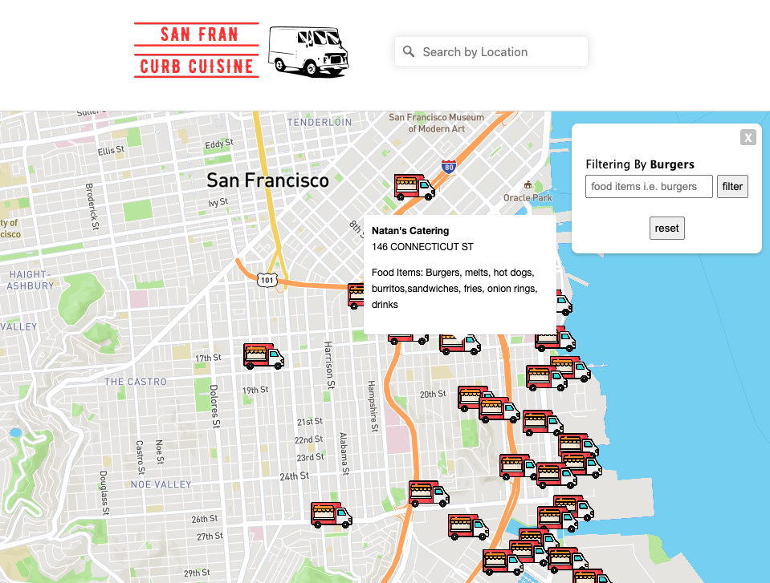

# 
Built for the Software Engineering Super League (SESL) using Mobile Food Facility Permit data provided by the San Francisco Department of Public Works. 

Prompt: Create a service that tells the user what types of food trucks might be found near a specific location on a map. Please submit a link to a hosted web app. The data is available on DataSF: https://data.sfgov.org/Economy-and-Community/Mobile-Food-Facility-Permit/rqzj-sfat

# Preview 

## Filter By Food Item
The app features a simple filtering functionality that enables users to narrow down the displayed trucks on the map based on whether the search term appears in the food item list of each truck.

# Technologies 
* HTML
* CSS
* JavaScript
* Node.js
* Express.js
* Mapbox GL JS
* The Socrata Open Data API (SODA)

# Next Steps
Items slated for future development include: 
* More robust food item filter functionality including the ability to filter by more than one item, having the map remain centered on the current coordinate points when a filter is made
* Incorporating scheduling details
* Improve mobile experience
